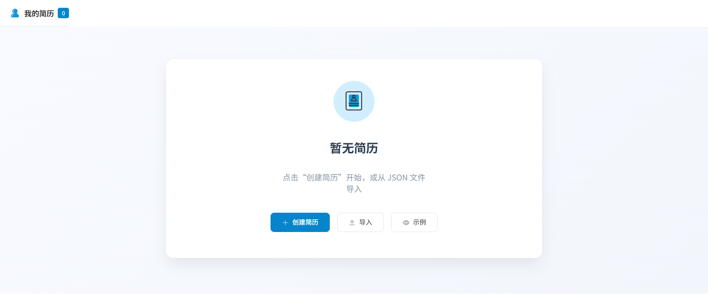
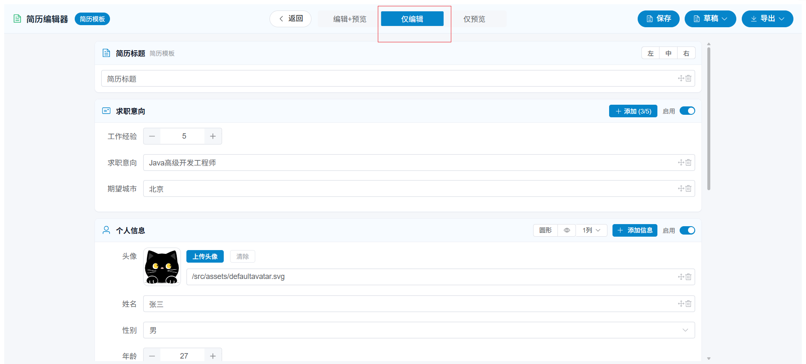
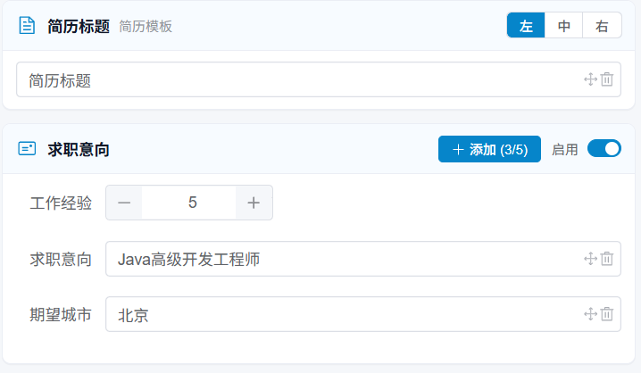
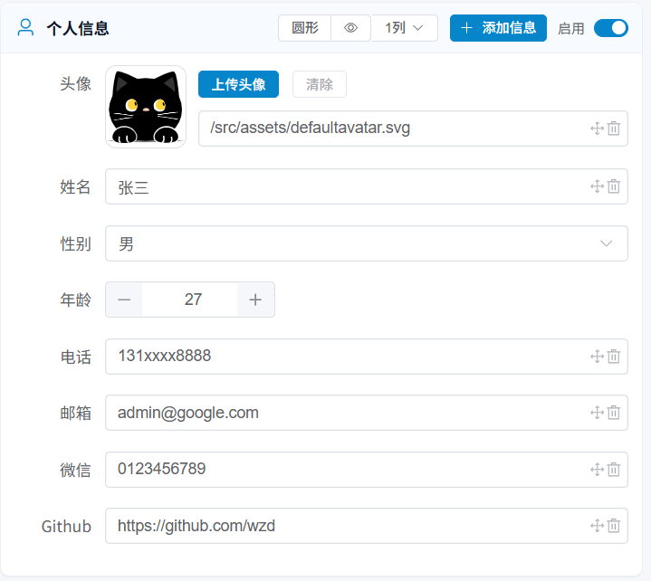
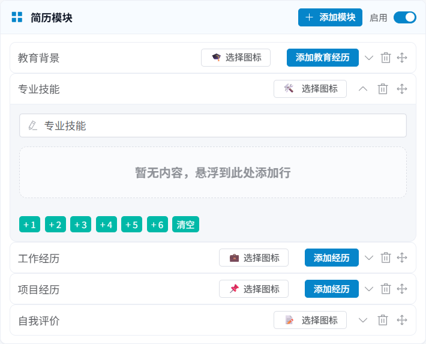

# mycurd-resume

一个基于 **Vue 3 + Vite + Element Plus** 的简历创建与编辑工具，支持本地保存、多模块编辑、预览以及导出（PDF/DOCX/JSON）。

## 在线预览

- **在线预览地址**：`TODO：请填写你的线上地址（例如 GitHub Pages / Vercel / Netlify）`

## 项目截图

> 建议把截图放到仓库的 `docs/images/` 或 `public/` 目录下，然后在这里引用。
>
> 示例（替换为你的实际图片路径）：
>
> 
> 
> 
> 
> 
> 
> 
> 

## 功能特性

- **简历创建与管理**
  - 创建新简历
  - 本地保存/读取（`localStorage`）
  - 简历列表（按更新时间排序）
  - 删除简历
- **编辑器**
  - 多模块编辑（教育背景/技能/工作经历/项目经历/自我评价等）
  - 支持模块启用/禁用、排序（拖拽）
  - 草稿自动保存（项目内含 `draft` 机制）
- **导入/导出**
  - 导入 JSON 简历文件
  - 导出 JSON 简历文件
  - 导出 PDF
  - 导出 DOCX
- **预览**
  - 内置预览渲染器与模板（`simple` 模板）

## 技术栈

- **框架**：Vue 3
- **构建**：Vite
- **路由**：vue-router
- **UI**：Element Plus（中文语言包 `zh-cn`）
- **拖拽**：SortableJS / vuedraggable
- **导出**：
  - PDF：`jspdf` + `html2canvas`
  - DOCX：`docx`
  - 文件保存：`file-saver`
- **代码质量**：ESLint + Prettier
- **样式**：SCSS（`sass-embedded`）

## 目录结构（核心）

```text
mycurd-resume/
  src/
    assets/
      styles/global.scss
    components/
      common/                  # 通用按钮：导入/导出/确认删除等
      editor/                  # 编辑器相关组件
      layout/                  # 页面布局
      preview/                 # 预览渲染与模板
    router/index.ts            # 路由：/ 与 /editor
    services/                  # 存储/导入导出/标准化
    stores/                    # 简历状态管理
    utils/                     # 工具：导出、格式化等
    views/
      Index.vue                # 首页
      ResumeEditor.vue         # 编辑页
    main.js                    # 入口：ElementPlus + Router
  vite.config.js               # 别名：@ -> src
  package.json
```

## 快速开始

### 1. 安装依赖

本项目包含 `pnpm-lock.yaml`，推荐使用 pnpm：

```bash
pnpm install
```

也可以使用 npm/yarn，但可能导致锁文件不一致。

### 2. 启动开发环境

```bash
pnpm dev
```

启动后按终端提示访问 Vite 提供的本地地址。

### 3. 构建

```bash
pnpm build
```

构建产物输出到 `dist/`。

### 4. 本地预览构建产物

```bash
pnpm preview
```

## 可用脚本

- **开发**：`pnpm dev`
- **构建**：`pnpm build`
- **预览**：`pnpm preview`
- **代码检查**：`pnpm lint`
- **自动修复**：`pnpm lint:fix`
- **格式检查**：`pnpm format`
- **格式化写入**：`pnpm format:write`

## 路由说明

- **`/`**：首页（简历列表、创建、导入）
- **`/editor`**：编辑页

## 数据存储说明

- 简历记录存储在浏览器 `localStorage`：
  - `mycurd-resume:records`
- 草稿存储键：
  - `mycurd-resume:draft`

因此：

- **清理浏览器站点数据会清空所有简历与草稿**。
- 这是纯前端本地存储方案，不依赖后端。

## 导入/导出说明

- **导入**：从 JSON 文件导入后会创建一条新的简历记录并进入编辑器。
- **导出 JSON**：会按简历标题生成文件名（内部会做文件名安全处理）。
- **导出 PDF/DOCX**：由 `src/utils/export/` 下的实现完成。

## 常见问题

### 1) 首页没有看到“创建简历”按钮？

首页的创建按钮仅在 `hasSaved` 为真时显示（即本地已有保存记录）。你可以：

- 先导入一个 JSON 简历文件
- 或者根据实际需求调整首页逻辑（`src/views/Index.vue`）

### 2) 数据怎么清空？

清空浏览器该站点的 `localStorage`，或在开发者工具里删除对应 key：

- `mycurd-resume:records`
- `mycurd-resume:draft`

## License

未声明（如需开源协议，请补充 LICENSE）。
